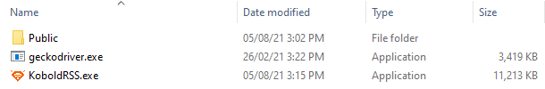

## Table of Contents

1. [Table of Contents](#table-of-contents)
2. [Quick-Start Guide](#Quick-Start Guide)
      3. [Download the Program](#download-the-program)
      4. [Starting the Generator & Server](#starting-the-Generator-&-Server)
      3. [Creating a New Feed](#creating-a-new-feed)
           1. [Defining the Feed](#defining-the-feed)
           2. [Creating an Item Pattern](#creating-an-item-pattern)
           4. [Defining the Items](#defining-the-items)
      6. [Starting the Generator](#starting-the-generator)
      7. [Managing your Feeds](#Managing your Feeds)
      8. [Adding a Feed to Your Feed Reader](#adding-a-feed-to-your-feed-reader)
      9. [Deleting a Feed](#deleting-a-feed)
3. [Requirements & Compatibility](#Requirements & Compatibility)
4. [Support the Developer](#support-the-developer)


## Introduction

###  What is KoboldRSS?

KoboldRSS is an RSS generator program that provides you with everything you need to create an RSS feed from a webpage that does not have one. The program itself has three parts:

1. A web scraper which periodically scans the page you're interested in
2. A generator which takes the scanned page and creates an RSS feed
3. A server which hosts the RSS feed locally so that your feed reader can see the feed

###  Why use KoboldRSS?

- KoboldRSS can scrape webpages behind login screens
- It can generate feeds on JavaScript rendered pages
- KoboldRSS uses RegEx pattern matching which is both quick and allows for complex logic
- Unlike other feed generators, KoboldRSS runs locally on your machine, keeping your feeds off the internet
- It has no limit to the number of feeds you can have
- You can set how frequently you want a feed to update
- KoboldRSS is open-source, so you can vet the code yourself
- It's free

###  Why the name?

Kobolds are mythical creatures associated with mining and mischievousness, and are usually depicted as sprites, or bipedal lizards or dogs.

You can imagine KoboldRSS as a bunch of Kobolds that scour the web for you and come back with your RSS feeds.

## Quick-Start Guide

###  Download the Program

To begin, [download the program](https://github.com/k-barber/KoboldRSS/releases)


If you instead opt to clone the git repo, or download the source code, I apologize for the mess.

Once you have downloaded the .zip file, unzip it and you should have a folder with the following contents:
  - a "Public" folder
  - a "geckodriver.exe" file
  - and the "KoboldRSS.exe" program





If that is correct, you are ready to begin.


*****

###  Starting the Generator & Server

The first step is to start up the server. In addition to serving the .xml files to your feed reader, the server provides a user-friendly web interface for the generator. 

To start the server, simply open the KoboldRSS.exe file. You should see the following screen:


By default, KoboldRSS hosts the web interface through port 8000, but you can theoretically choose any port between 1 and 65535 if you want.

To start up the server, simply click the "Start" button under "Server Options"

The server will be accessible to your machine at [localhost:8000](localhost:8000) and will be accessible to other computers on your LAN network (unless you have "Block requests from local machines checked". 

If you click the "Open Web Interface" button or manually open a web browser and go to [localhost:8000](localhost:8000), you should see something like the image below. 

If that is the case, you have correctly set up the server!


To start up the generator, simply click the "Start" button under "Generator Options"


*****

###  Creating a New Feed

To create a feed, simply go to the “New Feed” page and follow the instructions to fill out the form. Creating a new feed is the most difficult part of using the program, so if you have any questions you can refer to this document, mouse over a field for an explanation, or visit the [RSS official documentation](http://www.rssboard.org/rss-draft-1).

Creating a new Feed is broken into three parts:
  1.	Defining the feed
  2.	Creating an item pattern
  3.	Defining the items

To explain how to add a feed, I will provide a walkthrough using Wikipedia's "[Today's Featured Article](https://en.wikipedia.org/wiki/Wikipedia:Today%27s_featured_article)" page as an example.


####  Defining the Feed

Defining the feed is simply giving some basic information about the feed such as a Title/name, and a description. We’ll also add a link, which is where the feed will pull the data from.

In this case, our link is the Featured Article page "https://en.wikipedia.org/wiki/Wikipedia:Today%27s_featured_article".


####  Creating an Item Pattern

For the purpose of our feed we need the generator to convert articles into items in our feed. We do this by making an "Item Pattern".

If you look at the articles, they all have common traits:
-	an image
-	a summary
-	a link to the article

Each article will have these traits defined in the page's HTML data and the Item Pattern will tell the generator where in the HTML these traits are defined. 

To start, click the “Scrape URL” button, and watch as the “Scraped Page Source Data” box fills up. This box contains the raw HTML for the webpage we gave earlier in the “Feed Link” field.


Once we have the source data, we can write our Item Pattern. KoboldRSS Item Patterns are actually Regular Expressions (RegEx), that use capturing groups to gather information.

Regular Expressions, at their simplest are patterns of letters and other characters that are used to find matches in a piece of text. While working with RexExes, I recommend using a RegEx tester like [regex101.com](https://regex101.com/).

Regexes contain:

- **Literal characters**, like numbers or letters (so if my RegEx was `hat`, it would match all instances of "hat" in the text I'm searching)
- **Tokens**, which can match specific groups or types of characters, for example:
  - `\d` matches any digit so the RegEx `\d\d:\d\d` would match text like "12:30", "11:45", etc
  - `\s` matches any whitespace character, such as a space, a tab, or a newline
  - The token you'll probably use most often is `.`, which matches **any** character including letters, numbers, whitespace, newlines, etc. So the RegEx `.at` would match "cat", "hat", "sat", "pat", etc. If you want to actually match a period, use `\.` . By default `.` doesn't match newlines, but for the sake of simplicity in KoboldRSS `.` matches newlines as well.
- **Quantifiers**, which determine how many times a token should match, for example: 
  - A question mark, `?` matches 0 or one times, so `cats?` will match "cat", and "cats"
  - An asterisk, `*` matches 0 or more times, so `.*` will match EVERYTHING, `at .* o\'clock` will match "at 10 o'clock", "at five o'clock" etc. 
  - A plus, `+` will match 1 or more times, so `ca+ts?` will match "cat", "cats", "caaaaaaats", and "caaaat"
  - Curly brackets will match any other exact number
    - `\d{2}`  will match two digits, so in "123" it will match "12", and in "1234" it will match "12" and then "34" - RegEx matches never overlap, and always search for matches in order
    - `\d{1,2}` will match between 1 and 2 digits, so the regex `\d{1,2}:\d\d` will match "1:15", "12:30", "11:45", "9:19", etc.
    - `\d{2,}` will match 2 or more digits
  - Normally quantifiers match as many characters as they can, but this can ruin your results, especially if there is repeating content. For example  `at .* o\'clock` will match the entirety of "at 10 o'clock, at five o'clock", it won't stop at the first "clock". If you add a question mark after a quantifier, it will make the quantifier match as few characters as possible,  `at .*? o\'clock` will produce 2 matches from "at 10 o'clock, at five o'clock".
- **Capturing Groups**, regular brackets are used to indicate to the RegEx what information you are actually interested in. **KoboldRSS uses capture groups to extract the item data**. If we took our previous RegEx `at .*? o\'clock` and gave it a capture group like so `at (.*?) o\'clock`, it would still match in all the places it used to, but now it would also specifically return "10" and "five" from the previous examples. 

Let's get back to our example, starting with the image.

For the Wikipedia page, the images we're interested in are the orangutan, Shuttle-Centaur, and Foxy Brown. The image tags look like this:

- ``

- ``

- ``

We're really only interested in the URL that comes after "src", so for now let's simply set our Image Pattern to be `src=\"(.*?)\"` and see what happens.


The good news is that we got the images we were looking for, but we also got every other image on the page.

Since we don't want to get the entire page, we'll use the "Scraping Start Position" field to set a starting point. The starting point we'll use is the headline above the first article we're interested in, "From today's featured article".


Next, we want the article summary. Luckily Wikipedia has properly formatted their articles in nice little "\<p>" tags, so we can simply update our RegEx to grab an image and the content of the next "\<p>" tag. The new RegEx looks like this: `src=\"(.*?)\".*?<p>(.*?)</p>`


Now all that's left is to get the link to the full article. The link to the full article is at the end of the summary, so we'll just edit our RegEx again: 

`src=\"(.*?)\".*?<p>(.*?)\(<b><a href=\"(.*?)\".*?</p>`

When we test our pattern, you can see that KoboldRSS detected three items, the three featured articles, and each article has 3 fields, {%1} which contains the image URL, {%2} which contains the summary, and {%3} which contains the url for the full article.

With this, we can move on to defining the items.

####  Defining the Items

In this step we use the numbered placeholders we found above to define our items.

The Item Title will simply be "Today's featured article".

The Item Link will be "{%3}"

For the description, we want to add the image and the article summary.


Any HTML in the description needs to be within the `<!CDATA\[` tags. CSS can be inlined, but most readers will drop any `<style>` or `<script>` tags. If you don't want to use HTML in the description, you can simply delete the `<!CDATA\[` tags, or ignore them.

In our case, we want to display the image,, which will require HTML, and the summary is already HTML, so we'll keep the `<!CDATA\[` tags

In the end, our description is pretty simple:

```html
<![CDATA[
<div style="text-align:center;">

<br>
<br>
{%2}
</div>
]]>
```

This produces Feed Items that look pretty good:


There is still *one* small problem. None of the links work! to fix this we just update our description slightly:

```
<![CDATA[
<base href="https://en.wikipedia.org" />
<div style="text-align:center;">

<br>
<br>
{%2}
</div>
]]>
```


And we're done! Click "Submit"!


****

###  Managing your feeds


*****

###  Adding a Feed to Your Feed Reader


1.	Go to "My Feeds"
2.	Click on the feed you want to add
3.	You should see a Feed Details & Preview page like the one on the below

<p align="center">
  
</p>

4.	Copy this page's URL (Should be something like Localhost:8000/Feeds/Feed_Name.xml)
5.	Paste the URL into wherever your feed reader asks for the Feed URL

<p align="center">
  
</p>

*****

###  Deleting a Feed

Currently the only way to delete a feed is remove the feed from the Feed_Definitions.txt file and delete the feed's .xml file in the Feeds folder.

*****

## Requirements & Compatibility

**OS:** Windows 10

**Memory:** Enough to run a web browser

**Space:** 20 MB

**Feed reader compatibility:**

Since KoboldRSS hosts the feeds locally, it only works with feed readers that run on your computer (browser add-ons, standalone programs), not reader that are on a separate website

| Compatible                                                   | Incompatible                  |
| ------------------------------------------------------------ | ----------------------------- |
| [Feedbro](https://nodetics.com/feedbro/)<br />[QuiteRSS](https://quiterss.org/) | [Feedly](https://feedly.com/) |

****

## Frequently Asked Questions

 **Why isn't there a macOS or Linux distribution?**

When I compile the python program into an executable, it compiles it for the operating system that I'm using. Since I don't own a mac or a Linux machine, Windows is the only distribution available (for now). 

** Why are you using RegEx to parse HTML? Isn't that not possible?**

RegEx cannot parse *arbitrary* HTML, however since the Item Patterns are page-specific, this isn't an issue. There are of course alternatives to using RegEx, such as Xpaths or an XML parser, but many pages on the internet use improperly formed HTML, or meaningless, ever-changing class names, which can cause Xpaths or parsers to sputter to a halt. The biggest issue with RegEx is poorly formed expressions that result in catastrophic backtracking which is why the regex evaluation has been given a timeout.

** KoboldRSS can scrape pages behind login screens? Why should I trust you with my password?**

*You shouldn't*. At no point in the process does KoboldRSS ask for your password. KoboldRSS maintains a logged in state by using cookies. If KoboldRSS can't access the page, it opens up a web browser that attempts to connect to the website where you can log in securely, just you would normally. KoboldRSS runs on Gecko, the same web-interface that Mozilla Firefox uses, so it should show a lock icon to the left of the address indicating a secure connection. If you don't see this icon you should email whoever hosts that website and tell them to implement HTTPS. Once you log in, KoboldRSS saves that website's cookies and loads them into the headless (invisible) browser that scrapes pages. The cookie *should not* contain your username or password, but a string called a session token. If the cookie *does* contain your password you should once again email whoever hosts that website and shame them for their incorrect cookie management. 


*****

## Support the Developer

<div style="display:flex;justify-content: center;">
    <iframe id='kofiframe' src='https://ko-fi.com/k_barber/?hidefeed=true&widget=true&embed=true&preview=true' style='margin-top:20px;border:none;width:50%;padding:20px;background:#f9f9f9;' height='712' title='k_barber'></iframe>
</div>
